# Cat Sprite Style Guide
_(by anju)_

This is a guide for keeping the Clangen sprites in a consistent style to the original artwork for it. This is about the cats (or any other animals that might want to be added in the same style) and not about any background, accessories, patrol sprites, or other art.

Keeping accurate to the style may not be important in any mods created by fans, but it should be kept consistent in main game art when possible, or is highly favored to do so.

!!! note "Important"
    All the cat sprites should fit a 50 x 50 pixel box.

#### Spritesheets
Spritesheets is how the game picks which sprite parts to draw for each cat, by finding the exact position of each sprite from the whole canvas. The sprite parts are drawn on top of each other like layers, where the order of drawing decides which part is below or on top of another. The order of the parts goes like this:

1. Pelt
2. Possible tortie patch
3. Possible white patch
4. Scars
5. Eyes
6. Lineart
7. Skin
8. Missing limb mask
9. Accessories

One set of poses is 3 columns and 7 rows, with 21 sprite poses in total. Each of them is 50x50 pixels, making one pose sheet 150x350 pixels big. Entire spritesheets are multiples of the pose sheets, laid directly next to and under each other. The positions of the sprites has to be pixel-perfect.

This is how the linearts -spritesheet looks like, as an example.

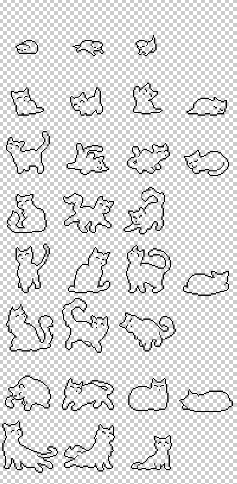

Some spritesheets (like white patches, scar, and accessory) have multiple pose sheets, look somewhat like this: (Only part of the sheet is shown - these can get big!)

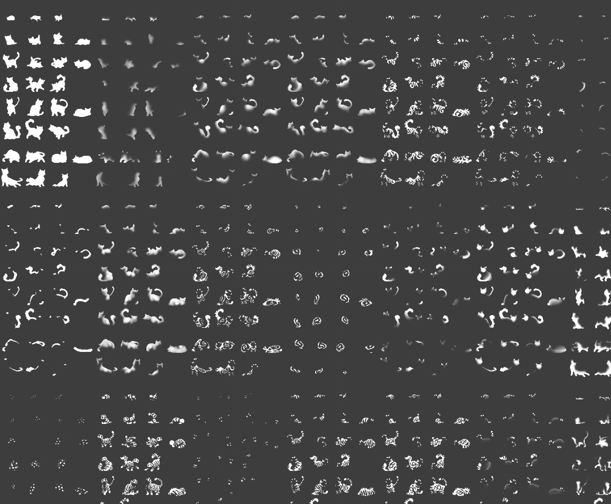

Some spritesheets are made to be masks rather than be drawn normally. At the time of writing this, the spritesheets that work as masks are the tortie patch, missing limb scar spritesheets, and pelt parts. We'll go over their uses individually.

## Lineart
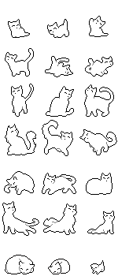

The lines should be kept at 1 px wide whenever possible. This means most of the free-hand strokes need to be cleaned up.

Like this:

Not like this:

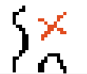

!!! note
    Exceptions should only be made in places like corners where erasing a pixel would change the shape in an odd way or make things unclear (often the ears).

Any lineart that goes inside the cat outline should be at **50% opacity** (the ear was an exception in one sprite). They should be used very sparingly- only in places where the shape/pose of the cat would look odd and unclear otherwise or to give the sprite depth, aka helping you see what is at the front and what is at the back. **Otherwise they should be left out.** Very small line extensions can be used inside the sprite if it looks good.

Examples;

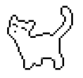

_This apprentice doesn’t have any helper lines, because you can see from a glance that it is holding one front paw up and other legs down, and tail up. The raised paw can be interpreted from either side of the cat, but it doesn’t confuse the eye most times and thinking about perspective, the pose looks flat either way._

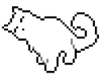

_This sprite uses helper lines because without them, the pose would look odd and confusing at first glance, and you couldn’t tell front legs from back legs. The helper lines also help show the depth of the sprite._

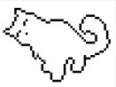

_Example of how said sprite would look without helper lines._

## Shape
The cat sprite proportions are not realistic, even the adults and elders have big and wide heads compared to real life cats. Kittens even moreso. They also have wide stubby legs and big eyes, and short bodies. This stylization makes it easier to give the cats more expressiveness and personality even at very small sizes.
No mouth visible unless it’s important for a specific pose, and a single pixel for a nose.

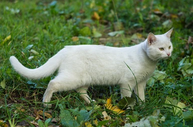
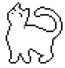

_I’m sure you can see the difference ^^_

!!! tip
    It’s good to come up with poses where the cat has an interesting and clear silhouette. This is good for character design in general. You can also find guides online to help with cat body language, so you can get ideas on how to show expression & personality through small changes in the pose.

## Coloring & Pelts

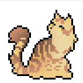
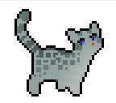

Cat pelts are specific patterns on the cats that come in multiple colors.
I’ll be referring to the stripes and spots and other markings on those as “patterns” and the colors underneath the markings as “base color”.

At runtime, the game constructs pelts by recoloring and layering various "pelt parts."  This includes gradients, pattern, and the base color. Keep this in mind when drawing new pelts. 

Pattern shapes should be clearly defined, not smudgy or blendy, and the more subtle differences in the fur color are shown with gradients. Airbrush is very good for the gradients. There are exceptions, but clear pattern shapes are preferred, and often gradient colors soften the bluntness of the pattern shapes anyway.

Oftentimes the gradient on the pattern is in reality more dramatic than what you’d expect looking at them, so don’t be afraid to make yours properly visible as well. You can look at already existing pelts to see if yours is visible enough.

!!! tip
    Personally I use a pure black airbrush to make most of the pattern gradients. The result isn’t an actual black of course, because of the softness of the brush, it just darkens any color a good amount to be a visible change.

Kittens usually have very simplistic pattern shapes designs compared to others. This is to keep the ‘simple is cute’ look, but also so that their small size doesn’t make the patterns look too cluttered.

## Colors
**As of writing this, there are a total of 19 different pelt colors;**
WHITE, PALEGREY, SILVER, GREY, DARKGREY, GHOST, BLACK,
CREAM, PALEGINGER, GOLDEN, GINGER, DARKGINGER, SIENNA,
LIGHTBROWN, LILAC, BROWN, GOLDEN-BROWN, DARKBROWN, CHOCOLATE, 
RUST and BLOSSOM.

While the colors can be quite straightforward with how they’re colored, there are some general rules as well as individual color quirks to a few of them that should be followed.  

### General:

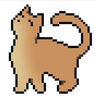

Most pelts have a little gradient of lighter color on their chest, running all the way from the face to their front legs and bellies (on certain sprites).
You’ll want to keep this gradient a subtle and smooth transition onto the other color. As a tip, it’s also usually better to use a different hue color for the lighter area than the base color for more interesting look, such as using pale **yellow** on an **orange** or **brown** pelt.

!!! caution
    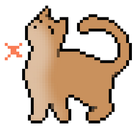

    Here’s what you want to avoid - the gradient transition isn’t subtle or smooth enough, so it ends up looking more like a simple brushstroke than a gradient as intended. The lighter color is also the same hue as the base orange, so while it doesn’t look bad, it’s less vibrant than using a different hue would be.

### Individual Color Quirks:

* All or most **GHOST** -colored pelts have lighter colored patterns than their base color. This is based on ghost tabbies in real life, that have black faces and extremities and lighter grays in their striped areas.
* While the base colors (excluding the pattern aka stripes and spots etc.) for most colors consist of two colors, (the base color and the lighter fur on the chest/face), **SILVER** and **GOLDEN** colored pelts as well as **all brown pelts** have a third color on their backs; A bit darker blueish gray on SILVER, a bit more reddish orange on GOLDEN, and different types of grays on the brown cats. You should try copying them from the existing pelts or draw your patterns on top of the single-colored pelts that already have them.

## White Patches
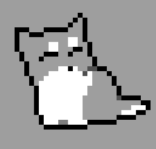
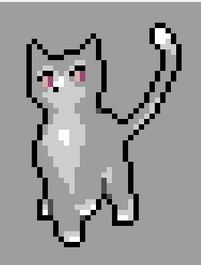

White patches are the patches of white that are combined with the base pelt colors. Please keep them separate from those pelt colors. The game has a function for generating tints for these patches that alter the hue and shade of them slightly, in 5 colors:
“none” (pure white), “offwhite”, “cream”, “darkcream”, “gray”, and “pink”.
You don’t need to worry about them. The white patches you design should just be a pure white color, the game will handle the rest of the color variation.

**When designing white patches for the cats, please use the pixel brush!** By this I don’t mean simply a brush that is the size of 1px, but a brush that will specifically only draw solid pixel-y squares with no soft edges, as seen in above images. There are some patches in the game that may not follow this advice, but it is highly recommended (and you may be asked to re-do your patches if they do not follow this advice).

Having semi-transparent parts in your white patches design is totally ok. However, to follow the style & to not look jarring, when you are using transparency for a gradient effect, please make these transparent parts into solid “waves” of white using the same pixel brush (with varying levels of opacity) instead of using other types of brushes to create gradients. This lets the spritework look more clean and deliberate.

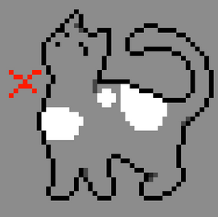
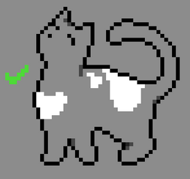

### Shapes:
When you draw out the shape of the patches, try to give them more depth by following the imagined shape of the cat! In this example, the patches on the first image **look very flat**, because they ignore the curve of the cat’s back and neck towards the camera and how that alters shapes. The second image shows the patches looking more natural because they **curve slightly according to how the cat’s 3D depth would be imagined.**

# Accessory Style Guide
_by scribble (scribblecrumb)_

Accessories (Accs) range from collars to leaves scattered through fur. We want to take care that any new accessories follow these guidelines:

- Do not obscure a significant amount of the cat (at most 1/3 of the cat may be covered)
- Accs should always be attached to the cat (exceptions allowed for younger age stages).  We don't want an acc to be a snail sitting next to the cat, for example.
- Likewise, accs should generally avoid being a living animal.  There's some leeway here, with insects for instance.  But we don't want a mouse clinging to the cat or a snake winding around it's shoulders.
- Natural accs (plants, feathers, ect.) should be attached to the cat in a believable way.  There is some suspension of disbelief when it comes to the attachment of these accs, but we do want to keep it within the realm of believablility.  This mostly pertains to the ability of cats to tie knots or obtain rope/string.  For the most part we want to avoid necklaces or "jewelry"-like accs.  However, if you have a good explanation for an acc that disobeys this rule then feel free to present it!  Nothing is ever completely out of the question.
- Avoid making natural accs out of plants that are outright poisonous to cats, unless there is canon evidence for warrior cats interacting with it positively.
- Do not create feather accs that place the feathers near the head/ears.  While there is much nuance and discussion to be had surrounding the use of feather decorations within Warriors fanworks, we have decided to allow feather accs as long as they are not attached to the head of the cat.
- New man-made accs (i.e. collars) must be made with the full range of colors (as of the writing of this guide, these are: ["CRIMSON", "BLUE", "YELLOW", "CYAN", "RED", "LIME", "GREEN", "RAINBOW","BLACK", "SPIKES", "WHITE", "PINK", "PURPLE", "MULTI", "INDIGO"]).  Please reference existing sprite sheets to match colors as best as possible.
- Accs feature slight shading.  Obviously we don't have much room for detail here, so use your best discretion regarding the level of shading to include.

!!! tip
    Less is more!  Accs are teeny tiny, you don't have many pixels to work with.  Simplify, simplify, simplify!

    Also, keep gravity in mind.  It's fun to let accs hang and drape off of the cat, and it makes them feel more real.

## Linework
Any linework that goes outside the cat sprite silhouette should be black, any linework that is inside the cat sprite silhouette should be colored.  

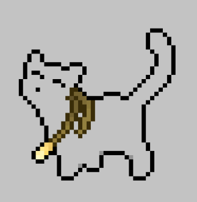
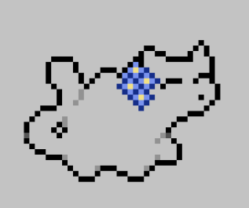
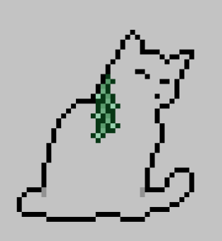

!!! tip
    You can use black lines vs. colored lines to imply depth!  This acc, for example, allows the black lineart of the cat's head to cover one side of the acc, implying that the acc is behind it's head.  If colored lineart had been used instead, it would have appeared that the acc was in front of the cat's head.

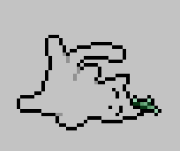
